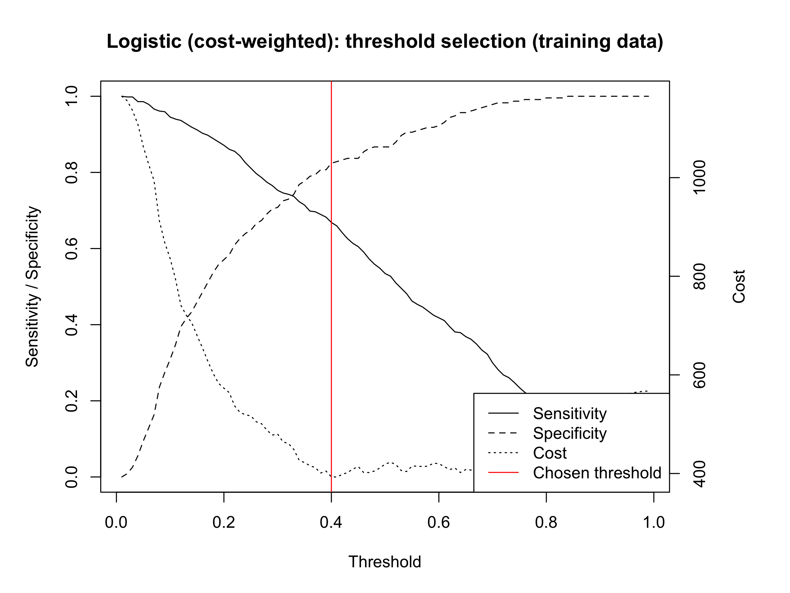
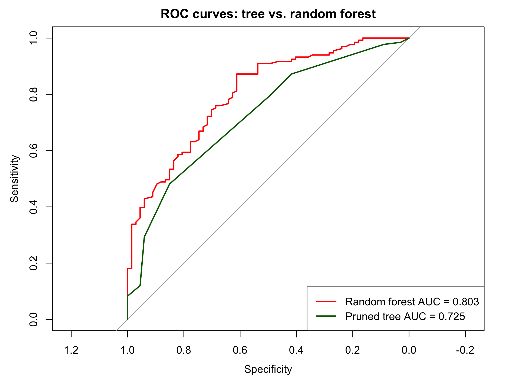

# Cost-Sensitive Credit Risk Classification

Statistical learning models for predicting credit risk on the [STATLOG German Credit dataset](https://archive.ics.uci.edu/dataset/144/statlog+german+credit+data), built for STAT 228. The project compares logistic regression, discriminant analysis, tree-based models, and support vector machines under the dataset's **asymmetric misclassification cost**: approving a bad applicant costs 5, while rejecting a good applicant costs 1.

## Why cost-sensitive?

A bank loses far more on a defaulted loan than it forgoes by declining a creditworthy applicant. Optimizing raw accuracy ignores this: a model that approves almost everyone can look "accurate" (70% of applicants are good) while being ruinously expensive. Every model here is therefore evaluated on **total expected cost** on a held-out test set, and decision thresholds are tuned to minimize that cost.

Two trivial policies frame the problem:

- **Approve everyone:** cost 335 on the test set (67 bad applicants x 5)
- **Reject everyone:** cost 133 (133 good applicants x 1)

A model is only useful if it beats 133. The best model here reaches **111**.

## Results

Test-set performance of all models (200 held-out applicants), sorted by total cost. Sensitivity = share of good applicants correctly approved; specificity = share of bad applicants correctly rejected.

| Model | Threshold | Misclassification | Sensitivity | Specificity | Cost | AUC |
|---|---|---|---|---|---|---|
| **Logistic (AIC)** | 0.77 | 0.315 | 0.617 | 0.821 | **111** | 0.797 |
| Logistic (cost-weighted) | 0.40 | 0.300 | 0.647 | 0.806 | 112 | 0.800 |
| Random forest (cost-tuned) | 0.74 | 0.350 | 0.556 | 0.836 | 114 | 0.803 |
| Classification tree (cost-tuned) | 0.72 | 0.395 | 0.481 | 0.851 | 119 | 0.725 |
| QDA (cost-tuned) | 0.79 | 0.345 | 0.594 | 0.776 | 129 | 0.776 |
| Logistic (BIC) | 0.73 | 0.315 | 0.654 | 0.746 | 131 | 0.780 |
| QDA | 0.50 | 0.270 | 0.759 | 0.672 | 142 | 0.776 |
| LDA | 0.50 | 0.260 | 0.880 | 0.463 | 196 | 0.802 |
| SVM (radial) | — | 0.260 | 0.887 | 0.448 | 200 | 0.798 |
| Classification tree | 0.50 | 0.290 | 0.842 | 0.448 | 206 | 0.725 |
| Random forest | 0.50 | 0.245 | 0.932 | 0.403 | 209 | 0.803 |
| SVM (linear) | — | 0.275 | 0.917 | 0.343 | 231 | 0.796 |
| SVM (polynomial) | — | 0.335 | 0.955 | 0.090 | 311 | 0.718 |

(Regenerate with `Rscript run_all.R`; the table is written to `results/model_comparison.csv`.)

### Key takeaways

- **Threshold tuning matters more than model choice.** The random forest has the best AUC (0.803) but at the default 0.5 threshold it costs 209 — worse than rejecting everyone. Shifting its threshold to 0.74 nearly halves the cost to 114. Every cost-tuned model beats every default-threshold model.
- **A cost-aware logistic regression wins overall** (cost 111), despite "fancier" models being available. It is also the most interpretable option — a real advantage in credit decisioning, where adverse-action reasons must be explainable.
- **Higher accuracy does not mean lower cost.** The lowest-misclassification model (random forest at 0.5, 24.5% error) has one of the *highest* costs because its errors are concentrated in the expensive direction.
- **SVMs underperform under this criterion** because they output hard class labels; even with 5:1 class weights they cannot be threshold-tuned as flexibly as probabilistic models.

### Selected figures

| Threshold selection (weighted GLM) | ROC: tree vs. random forest |
|---|---|
|  |  |

## Data

- **Source:** STATLOG German Credit Data (Hofmann, 1994), via the UCI Machine Learning Repository. The numeric version (`data/german.data-numeric`) is used: 1,000 applicants, 24 predictors (checking account status, loan duration and amount, credit history, savings, employment, housing, purpose indicators, etc.).
- **Outcome:** binary credit risk, recoded so that 1 = good credit, 0 = bad credit (70% / 30%).
- **Split:** fixed 800/200 train/test split (`set.seed(1)`), written to CSV once so that every model trains and is evaluated on identical data.

## Methodology notes

Decisions made specifically to avoid information leakage:

- Hyperparameters (SVM cost/gamma) are selected by **10-fold cross-validation on the training set only**, minimizing expected *cost* rather than error rate.
- Decision thresholds are chosen on **training-side probabilities only** — in-sample for GLM/QDA/tree, and **out-of-bag** probabilities for the random forest. The test set is touched exactly once per model, for final evaluation.
- Feature standardization for LDA/QDA uses training means and standard deviations applied to the test set.

Other notes:

- Multicollinearity was screened with generalized VIF on a full logistic model; all adjusted GVIF values are below 2.5, so all predictors were retained (`figures/vif_barplot.png`).
- LDA/QDA assumptions were checked: QQ plots show modest departures from normality, and Box's M rejects homogeneous covariances (p < 2.2e-16), favoring QDA over LDA in principle — consistent with QDA's lower cost.

## Repository structure

```
├── 1_data_cleaning.R          # Rename columns, recode outcome, 800/200 split
├── 2_variable_selection.R     # GVIF multicollinearity screening
├── 3_logistic_regression.R    # AIC/BIC stepwise + cost-weighted GLM
├── 4_discriminant_analysis.R  # LDA, QDA + assumption checks
├── 5_tree_models.R            # Pruned classification tree, random forest
├── 6_svm_models.R             # Linear/polynomial/radial SVM, CV-tuned by cost
├── utils.R                    # Shared metrics, threshold selection, plotting
├── run_all.R                  # Runs the full pipeline, builds comparison table
├── install_packages.R         # Installs required packages
├── data/                      # Raw UCI files + cleaned/split CSVs
├── figures/                   # Generated plots
└── results/                   # Generated metrics tables (CSV)
```

## Reproducing the analysis

Requires R (developed on 4.4.2).

```bash
Rscript install_packages.R   # car, pROC, e1071, MASS, tree, randomForest, biotools
Rscript run_all.R            # ~30 seconds; regenerates data splits, figures, results
```

Each numbered script can also be run independently — they all read from the CSVs produced by `1_data_cleaning.R`.

## Limitations and future work

- With 200 test observations, cost differences of ~10–20 between the top models are within noise; repeated cross-validation or nested CV would give more stable rankings.
- Thresholds are tuned partly on in-sample probabilities (except the random forest, which uses out-of-bag estimates); a dedicated validation fold would be cleaner still.
- The categorical version of the dataset (`data/german.data`) retains richer factor levels that the pre-encoded numeric version collapses; modeling from it directly could improve performance.
- Gradient boosting and calibrated probability models (e.g., isotonic-calibrated random forest) are natural next candidates.

## References

- Hofmann, H. (1994). *Statlog (German Credit Data)*. UCI Machine Learning Repository. https://doi.org/10.24432/C5NC77
- James, G., Witten, D., Hastie, T., & Tibshirani, R. *An Introduction to Statistical Learning*.

## License

[MIT](LICENSE)
